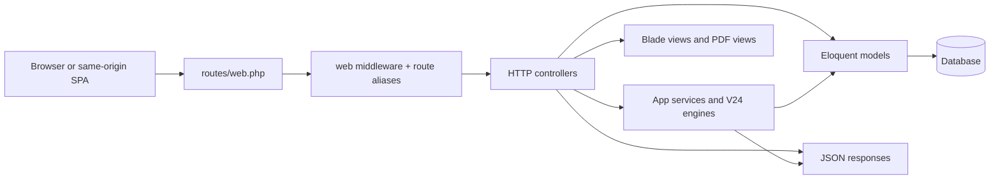
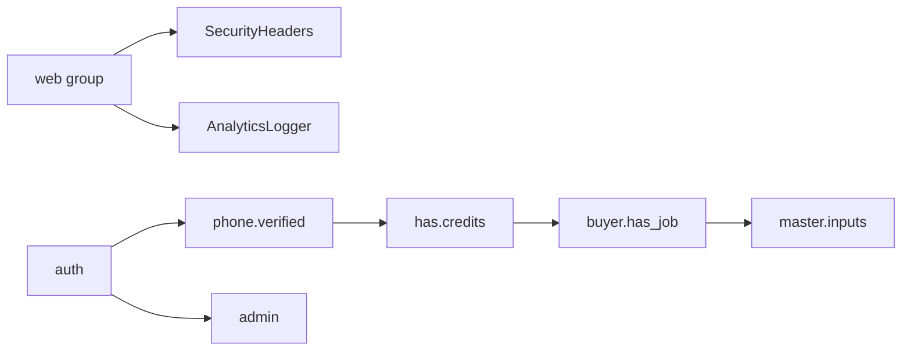
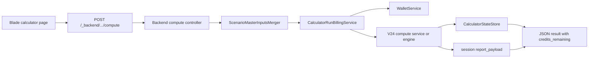
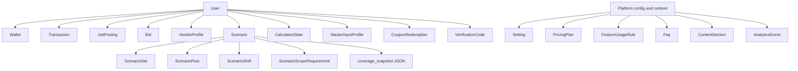
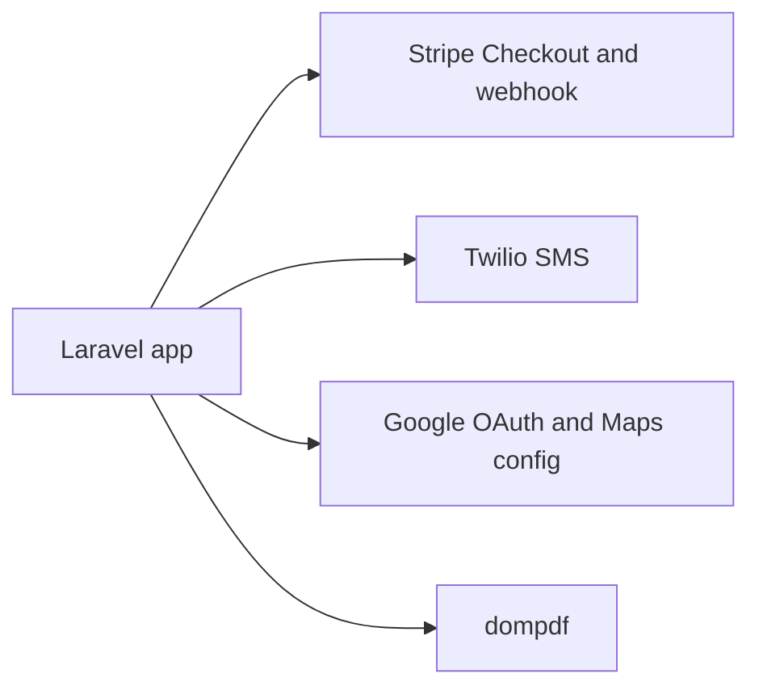

# GASQ Laravel Repo Graph

Checked against the current repository on 2026-04-21.

This is a fast orientation map for the main Laravel app in `.`.

## System Overview



## Top-Level Shape

```text
gasq-laravel
├── app/
│   ├── Http/Controllers/       route entry points, backend compute, auth, admin, API
│   ├── Http/Middleware/        analytics, security headers, auth/credit gates
│   ├── Http/Requests/          form validation
│   ├── Models/                 marketplace, wallet, scenario, content, auth models
│   ├── Services/               business logic, billing, reporting, calculator engines
│   ├── Events + Listeners/     credits-granted event flow
│   ├── Mail + Notifications/   email and in-app/user notifications
│   └── Console/Commands/       operational commands
├── bootstrap/app.php           app boot, routing, middleware aliases
├── config/                     framework, credits, maps, mail, services
├── database/                   migrations, schema history, factories, seeders
├── docs/                       architecture and operating docs
├── public/                     web root and compiled assets
├── resources/
│   ├── views/                  Blade pages, calculators, admin, auth, PDFs, emails
│   ├── js/                     light frontend bootstrap
│   └── css + sass/             styles
├── routes/
│   ├── web.php                 primary route graph
│   └── console.php
├── scripts/                    support and parity scripts
├── tests/                      feature, unit, and golden-fixture parity tests
└── my-video/                   separate sidecar project, not main Laravel runtime
```

## Route Domains

```mermaid
flowchart TD
    R[routes/web.php]

    Public[Public pages]
    AuthOnly[Auth and profile]
    CalculatorPages[Protected calculator pages]
    Compute[Backend compute APIs]
    Marketplace[Marketplace]
    Scenario[Scenario graph APIs]
    Credits[Credits and reporting]
    Admin[Admin]

    R --> Public
    R --> AuthOnly
    R --> CalculatorPages
    R --> Compute
    R --> Marketplace
    R --> Scenario
    R --> Credits
    R --> Admin

    Public --> P1["/, /pricing, /faq, /payscale, /payment-model"]
    Public --> P2["preview calculators like /gasq-tco-calculator and /government-contract-calculator"]

    AuthOnly --> A1["/phone/verify*"]
    AuthOnly --> A2["/profile*"]
    AuthOnly --> A3["/api/spa/session, /api/spa/wallet/spend, /api/master-inputs*"]
    AuthOnly --> A4["/discovery-call, /credits, /account-balance"]

    CalculatorPages --> C1["/main-menu-calculator"]
    CalculatorPages --> C2["/security-billing"]
    CalculatorPages --> C3["/mobile-patrol-calculator and /mobile-patrol-comparison"]
    CalculatorPages --> C4["standalone Blade calculator pages"]

    Compute --> B1["/_backend/main-menu/compute"]
    Compute --> B2["/_backend/security-billing/compute and /v24/compute"]
    Compute --> B3["/_backend/contract-analysis/v24/compute"]
    Compute --> B4["/_backend/mobile-patrol/v24/compute"]
    Compute --> B5["/_backend/instant-estimator/compute"]
    Compute --> B6["/_backend/standalone/{type}/v24/compute"]
    Compute --> B7["/_backend/report-payload"]

    Marketplace --> M1["/jobs, /jobs/{job}"]
    Marketplace --> M2["/vendor-profile/{user}"]
    Marketplace --> M3["/bids/*, /open-bid-offer"]

    Scenario --> S1["/_backend/scenarios"]
    Scenario --> S2["/_backend/scenarios/{scenario}"]
    Scenario --> S3["/_backend/scenarios/{scenario}/payload"]

    Credits --> CR1["/credits/checkout/{plan}"]
    Credits --> CR2["/credits/redeem"]
    Credits --> CR3["/reports/download, /reports/email, /reports/receipt/{transaction}"]
    Credits --> CR4["/stripe/webhook"]

    Admin --> AD1["/admin/analytics"]
    Admin --> AD2["/admin/settings"]
    Admin --> AD3["/admin/tokens"]
    Admin --> AD4["/admin/coupons, /admin/faqs, /admin/content-sections"]
```



## Middleware and Access Gates



`bootstrap/app.php` wires the global `web` middleware and aliases:
`admin`, `phone.verified`, `has.credits`, `buyer.has_job`, and `master.inputs`.

## Calculator Execution Graph



Key pattern:

- Controllers validate input, merge saved master inputs, charge credits, run the engine, persist last state, and return JSON.
- Standalone V24 calculators route through `App\Http\Controllers\Backend\StandaloneV24ComputeController`.
- PDF download and email flows depend on the stored session payload and report views under `resources/views/pdf`.

## Service Layout

```text
App\Services
├── WalletService
├── CalculatorRunBillingService
├── CalculatorStateStore
├── CalculatorViewStateResolver
├── ScenarioService
├── ScenarioMasterInputsMerger
├── MasterInputsService
├── CouponRedemptionService
├── ReportService
├── TwilioSmsService
├── MainMenuCalculatorService
├── ContractAnalysisService
├── MobilePatrolService
├── SecurityBillingService
└── V24/
    ├── MainMenu/
    ├── ContractAnalysis/
    ├── SecurityBilling/
    ├── MobilePatrol/
    ├── InstantEstimator/
    └── Standalone/
```

The center of gravity is `app/Services/V24`, with thin controllers delegating real computation into service classes and engines.

## Domain Model Graph



## External Integrations



Current integration touchpoints:

- Stripe credits purchase flow lives in `StripeCreditsController` and `WalletService`.
- Twilio SMS is used by `TwilioSmsService` for OTP-style messaging.
- Google OAuth is handled through Socialite in `Auth/GoogleController`; maps keys are configured separately.
- PDF generation is centralized in `ReportService`.

## What This Repo Is Optimized Around

- A server-rendered Laravel app with Blade-first delivery, not a React-first SPA.
- Calculator and pricing logic implemented in PHP services, especially under `app/Services/V24`.
- Scenario payloads and golden fixtures as the main parity/confidence mechanism.
- Marketplace, credits, OTP verification, and admin tooling as first-class product areas.
- A sidecar `my-video/` project that is adjacent to, but separate from, the main runtime.
